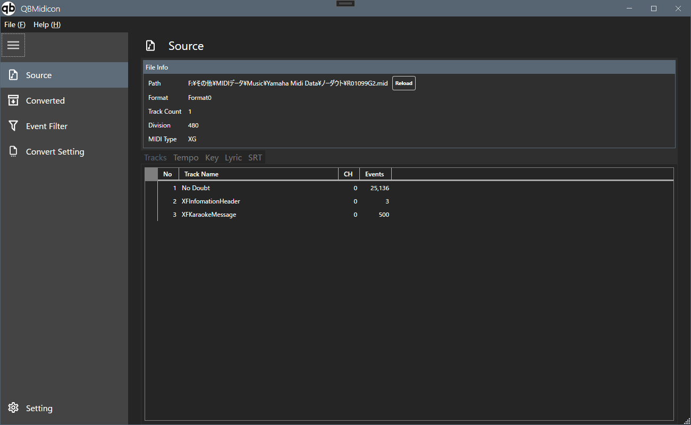

# QBMidicon

SMF（Standard MIDI File）を読み込み、DAWで使いやすい形式にフィルタリング・変換するWindows用ツールです。  

A Windows tool that loads Standard MIDI Files (SMF) and filters/converts them into a format that's easier to use in a DAW.

## 概要 / Overview

**日本語**
QBMidicon は、SMFファイルを読み込み、トラックやイベントの内容を確認しながら、不要なイベントの除去やトラック情報の整理、歌詞・SRTデータの調整などを行い、変換後のMIDIデータとして書き出すためのツールです。歌詞イベントをトラックのMIDIデータに引き当てる機能もあり、Synthesizer V に取り込める歌詞付きヴォーカルMIDIも単独で出力できます。

**English**
QBMidicon loads SMF files and lets you inspect their tracks and events, remove unwanted events, clean up track information, and adjust lyric/SRT data before exporting the result as converted MIDI data. It can also match lyric events to a track's MIDI notes, and export a standalone lyric-tagged vocal MIDI file that can be imported into Synthesizer V.

---

## 主な機能 / Features

- **日本語**
  - SMFファイルの読み込み・トラック/テンポ/キー/歌詞/SRT情報の確認
  - Event Filter によるイベント種別ごとの変換対象選別
  - Convert Setting による変換オプションの詳細設定
  - トラックごとのイベント詳細表示（右クリックメニューから）
  - 歌詞イベントのトラックへの引き当て、Lyric % による一致率表示
  - Synthesizer V 用の歌詞付きヴォーカルMIDIの単独出力
  - Raw Data / Filtered Data / Lyric Track Data / Lyric Text Data / Lyric SRT Data の個別出力

- **English**
  - Load SMF files and inspect track / tempo / key / lyric / SRT information
  - Select which event types are included in the conversion via Event Filter
  - Fine-tune conversion behavior via Convert Setting
  - View per-track event details (via right-click context menu)
  - Match lyric events to a track's notes, with a Lyric % match-rate indicator
  - Export a standalone lyric-tagged vocal MIDI file for Synthesizer V
  - Export Raw Data / Filtered Data / Lyric Track Data / Lyric Text Data / Lyric SRT Data individually

---

## 動作環境 / Requirements

- **日本語**：Windows OSのみ対応
- **English**：Windows only

---

## インストール / Installation

**日本語**
1. [Releases](https://github.com/MinMax25/QBMidicon/releases) から最新のZIPファイルをダウンロードします
2. 任意の場所に展開し、`QBMidicon.exe` を実行します

**English**
1. Download the latest ZIP from the [Releases](https://github.com/MinMax25/QBMidicon/releases) page
2. Extract it to any folder and run `QBMidicon.exe`

アンインストールする場合はフォルダごと削除してください（レジストリは使用していません）。
To uninstall, simply delete the extracted folder (the app does not use the Windows registry).

---

## 操作ガイド / User Guide

詳しい操作方法は [docs](https://minmax25.github.io/QBMidicon/) を参照してください。  

For detailed usage instructions, see the [docs](https://minmax25.github.io/QBMidicon/) site.

---

## 免責事項 / Disclaimer

**日本語**
本ソフトウェアは「フリーソフト」であり、個人での利用に限り無償で使用可能とします。本ソフトウェアは、その不具合、または、本ソフトウェアを利用することによって生じたあらゆる損害について、作者または提供者は一切の責任を負いません。ソフトウェアの入手および利用は、利用者の自己の責任と費用により行ってください。本ソフトウェアは、予告なく提供を中止することがあります。

**English**
This software is freeware, free to use for personal purposes only. The author/provider assumes no responsibility for any defects or damages arising from the use of this software. Use of this software is at the user's own risk and expense. This software may be discontinued without prior notice.

---

## ライセンス / License

MIT License.

---

## Credits

&copy; 2025-2026 Min Max
